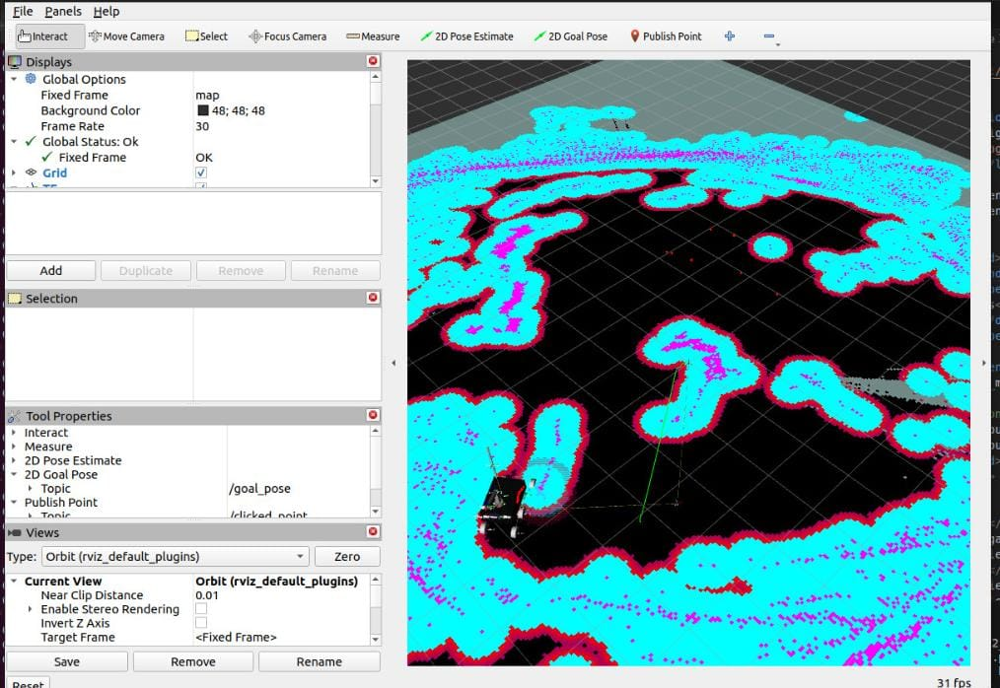

# GPS Autonomous Navigation (ROS 2)

A ROS 2 package for GPS-based autonomous navigation using LiDAR, SLAM Toolbox,
and the Nav2 stack.

---

## Overview
This package implements a GPS-based autonomous navigation system in ROS 2.
It converts GPS coordinates (latitude, longitude) into local map-frame goals
and uses the Nav2 stack to autonomously navigate a mobile robot while avoiding
obstacles.

The system follows a modular ROS 2 architecture where navigation, localization,
and motor control are decoupled through topics and actions.

---

## Features
- GPS to local coordinate conversion (latitude/longitude → map frame)
- Interactive GPS goal sender via terminal
- SLAM Toolbox integration for real-time mapping
- Autonomous navigation using Nav2
- LiDAR support (RPLidar A1 M8 via `sllidar_ros2`)
- RViz visualization support

---
## System Architecture

The system is designed as a layered ROS 2 + micro-ROS architecture, where
high-level navigation runs on a Linux system and low-level motor control runs
on an ESP32 microcontroller.

### 1. Sensor Layer

GPS (/fix)           LiDAR (/scan)
   │                    │
   ▼                    ▼

## 2. Perception & Mapping

+-----------------------+
|   SLAM Toolbox        |
|   - Builds map        |
|   - Publishes /map    |
+-----------------------+

## 3. GPS Processing

+-----------------------------+
| GPS → Local Converter Node  |
| - lat/lon → map frame (x,y) |
| - Publishes goal_pose       |
+-----------------------------+

## 4. Localization & TF

map → odom → base_link

## 5. Navigation (Nav2)

+------------------------------+
| Nav2 Stack                   |
| - Global planner             |
| - Local controller           |
| - Costmaps                   |
+------------------------------+
            |
         /cmd_vel

## 6. Motor Control (micro-ROS)

+------------------------------+
| micro-ROS Agent              |
| (Linux / SBC)                |
+------------------------------+
            |
            ▼
+------------------------------+
| ESP32 (micro-ROS client)     |
| - Subscribes to /cmd_vel     |
| - Converts to PWM            |
+------------------------------+
            |
            ▼
        Motors
---

## Prerequisites

### Required ROS 2 Packages
```bash
sudo apt update
sudo apt install ros-$ROS_DISTRO-slam-toolbox
sudo apt install ros-$ROS_DISTRO-navigation2
sudo apt install ros-$ROS_DISTRO-nav2-bringup
sudo apt install ros-$ROS_DISTRO-robot-state-publisher
sudo apt install ros-$ROS_DISTRO-joint-state-publisher
sudo apt install ros-$ROS_DISTRO-xacro
sudo apt install ros-$ROS_DISTRO-tf2-ros
sudo apt install ros-$ROS_DISTRO-tf2-geometry-msgs

## Hardware

    RPLidar A1 M8 (or compatible LiDAR)

    Differential drive mobile robot (configured in URDF)

## Build Instructions

cd ~/ROS_WS
colcon build
source install/setup.bash

## Run Order (Important)

Follow this order to run the system correctly:

1. Start LiDAR driver  
2. Start SLAM Toolbox or localization  
3. Launch Nav2 bringup  
4. Start the GPS goal sender  
5. (If using hardware) Start micro-ROS agent and ESP32 firmware

Incorrect order may cause Nav2 or GPS goals to fail.

## Usage
1. Complete Navigation (Recommended)

Launch the complete navigation system with all components:

ros2 launch gps_autonomous_navigation complete_navigation_launch.py

With custom parameters:

ros2 launch gps_autonomous_navigation complete_navigation_launch.py \
  serial_port:=/dev/ttyUSB0 \
  origin_lat:=12.9716 \
  origin_lon:=77.5946

2. Without RViz

ros2 launch gps_autonomous_navigation complete_navigation_launch.py use_rviz:=false

3. Individual Components (Debugging)

# Robot description
ros2 launch gps_autonomous_navigation robot_description_launch.py

# LiDAR only
ros2 launch gps_autonomous_navigation lidar_launch.py

# SLAM only
ros2 launch gps_autonomous_navigation slam_toolbox_launch.py

# Nav2 only
ros2 launch gps_autonomous_navigation nav2_launch.py

# GPS Goal Sender only
ros2 launch gps_autonomous_navigation gps_goal_sender_launch.py

Sending GPS Goals

Once the navigation system is running, an interactive terminal prompt is available:

============================================================
GPS NAVIGATION GOAL SENDER
============================================================

Commands:
  <lat> <lon>        - Send GPS goal (e.g., 12.9716 77.5946)
  <lat>,<lon>        - Send GPS goal with comma separator
  origin <lat> <lon> - Set GPS origin point
  cancel             - Cancel current navigation goal
  status             - Show current navigation status
  help               - Show this help message
  quit / exit        - Exit the program

## How GPS Coordinates Work

    The first GPS coordinate entered is treated as the local origin (0, 0).

    All subsequent coordinates are converted relative to this origin and sent
    to Nav2 as local navigation goals.

## Example workflow:

> 12.9700 77.5900
[ORIGIN AUTO-SET] lat=12.9700, lon=77.5900
[INFO] Local frame origin set to (0, 0)

> 12.9716 77.5946
[CONVERTING] GPS -> Local (x=480.2m, y=177.4m)
[SENDING GOAL] Goal sent to Nav2

## Configuration Files
## Nav2 Parameters

Edit config/nav2_params.yaml to tune:

    Robot footprint / radius

    Planner parameters

    Controller parameters

    Costmap settings

## SLAM Toolbox Parameters

Edit config/slam_toolbox_params.yaml to tune:

    Loop closure settings

    Scan matching parameters

    Map resolution

## Frame Structure

map
 └── odom
      └── base_footprint
           └── base_link
                ├── laser_frame
                └── other robot links

Topics
Subscribed

    /scan – Laser scan from LiDAR

    /odom – Odometry source

Published

    /cmd_vel – Velocity commands

    /map – SLAM-generated map

    /goal_pose – Current navigation goal

## Troubleshooting
LiDAR not detected

ls /dev/ttyUSB*
sudo cp /path/to/sllidar_ros2/scripts/rplidar.rules /etc/udev/rules.d/
sudo udevadm control --reload-rules
sudo udevadm trigger

## SLAM not building map

    Ensure LiDAR is publishing on /scan

    Check TF tree: ros2 run tf2_tools view_frames

    Verify odometry is being published

Nav2 not accepting goals

    Ensure Nav2 lifecycle nodes are active

    Ensure SLAM is publishing /map

    Verify TF chain: map → odom → base_link

## Save map for later use

ros2 run nav2_map_server map_saver_cli -f ~/maps/my_map

---

## Navigation Output

The image below shows the robot navigating to a GPS-defined goal using the Nav2 stack.
The local map is generated using LiDAR-based SLAM, and the planned path is visualized
in RViz.



## Motor Control (micro-ROS)

Low-level motor control is handled by an ESP32 microcontroller using micro-ROS.
The ESP32 subscribes to `/cmd_vel` messages published by Nav2 and drives the robot motors.

Firmware repository:
https://github.com/KavyaSivakumar2006/micro-ros-motor-control

## License

Apache-2.0
