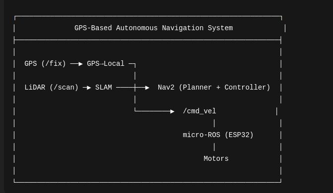
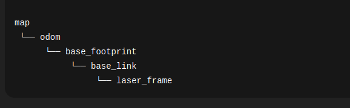

---

# GPS-Based Autonomous Navigation (ROS 2)


A ROS 2–based autonomous navigation system that uses **GPS goals**, **LiDAR-based SLAM**, and the **Nav2 stack**, with **ESP32 motor control via micro-ROS**.

---

## Overview

This project implements a **GPS-driven autonomous navigation pipeline** in ROS 2.
The robot accepts GPS coordinates (latitude, longitude), converts them into **local map-frame goals**, and navigates autonomously while avoiding obstacles.

The system is designed using a **layered architecture**, separating:

* High-level navigation and planning (ROS 2)
* Low-level motor control (micro-ROS on ESP32)

This separation ensures **modularity, reliability, and scalability**.

---

## System Architecture

The overall system architecture of the GPS-based autonomous navigation stack 
integrates GPS, LiDAR-based SLAM, Nav2 planning and micro-ROS motor control (cmd vel ) on ESP32.




### 1. Sensor Layer

* **GPS** publishes global position (`/fix`)
* **LiDAR** publishes obstacle data (`/scan`)

---

### 2. Mapping & Perception

* **SLAM Toolbox**

  * Builds a real-time occupancy grid
  * Publishes `/map`
  * Uses LiDAR data for mapping

---

### 3. GPS Processing

* **GPS → Local Converter Node**

  * Converts latitude & longitude to local `(x, y)`
  * Uses first GPS point as map origin
  * Publishes navigation goal (`/goal_pose`)

---

### 4. Localization & TF

* Maintains the TF chain:

```
map → odom → base_link
```

* Ensures consistent frame alignment for navigation

---

### 5. Navigation (Nav2)

* **Global Planner**: Computes collision-free path
* **Local Controller**: Tracks path and avoids obstacles
* **Costmaps**: Dynamic + static obstacle handling
* Publishes velocity commands on `/cmd_vel`

---

### 6. Motor Control (micro-ROS)

* **micro-ROS Agent** runs on Linux/SBC
* **ESP32 micro-ROS client**

  * Subscribes to `/cmd_vel`
  * Converts velocity commands to PWM
  * Drives the motors in real time

---

## Features

* GPS to local map-frame conversion
* Autonomous navigation using Nav2
* Real-time LiDAR-based SLAM
* Interactive GPS goal sender
* RViz visualization
* micro-ROS–based ESP32 motor control

---

## Hardware Requirements

* RPLidar A1 M8 (or compatible)
* Differential drive mobile robot
* ESP32 microcontroller
* Motor driver compatible with PWM

---

## Software Requirements

* ROS 2 Humble
* Nav2
* SLAM Toolbox
* micro-ROS
* RViz2

---

## Installation

### 1. Install ROS 2 and Nav2
```bash
sudo apt update
sudo apt install ros-humble-desktop
sudo apt install ros-humble-navigation2 ros-humble-nav2-bringup
sudo apt install ros-humble-slam-toolbox

---

### Build Instructions

```bash
cd ~/ROS_WS
colcon build
source install/setup.bash
```

---

## Run Order (IMPORTANT)

Follow this sequence strictly:

1. Start LiDAR driver
2. Start SLAM Toolbox
3. Launch Nav2
4. Start GPS goal sender
5. Start micro-ROS agent + ESP32 firmware

Incorrect order may cause navigation failures.

---

## Usage

### Full Navigation System

```bash
ros2 launch gps_autonomous_navigation complete_navigation_launch.py
```

With custom GPS origin:

```bash
ros2 launch gps_autonomous_navigation complete_navigation_launch.py \
  origin_lat:=12.9716 \
  origin_lon:=77.5946
```

---

### Individual Components (Debugging)

```bash
# Robot description
ros2 launch gps_autonomous_navigation robot_description_launch.py

# LiDAR
ros2 launch gps_autonomous_navigation lidar_launch.py

# SLAM
ros2 launch gps_autonomous_navigation slam_toolbox_launch.py

# Nav2
ros2 launch gps_autonomous_navigation nav2_launch.py

# GPS Goal Sender
ros2 launch gps_autonomous_navigation gps_goal_sender_launch.py
```

---

## Sending GPS Goals

Once running, the terminal accepts GPS inputs:

```
<latitude> <longitude>
<latitude>,<longitude>
origin <latitude> <longitude>
cancel
status
help
exit
```
---

### How GPS Coordinates Work

First GPS coordinate sets the local origin (0,0)

All future coordinates are converted relative to this origin

Converted goals are sent to Nav2 as map-frame goals

---

## TF Tree

The TF tree shows the relationship between map, odom, base_link, and sensor frames.



---

## Key Topics

| Topic      | Type                      | Description        |
| ---------- | ------------------------- | ------------------ |
| /scan      | sensor_msgs/LaserScan     | LiDAR data         |
| /map       | nav_msgs/OccupancyGrid    | SLAM-generated map |
| /cmd_vel   | geometry_msgs/Twist       | Velocity commands  |
| /goal_pose | geometry_msgs/PoseStamped | Navigation goal    |
| /odom      | nav_msgs/Odometry         | Robot odometry     |

---

## Example Workflow

```
> 12.9700 77.5900
[ORIGIN SET] Local map origin initialized

> 12.9716 77.5946
[GOAL SENT] Robot navigating to GPS goal
```

---

## Navigation Output

RViz visualization of GPS-based autonomous navigation:


---

## Motor Control (micro-ROS)

ESP32 firmware subscribes to `/cmd_vel` and drives motors using PWM.

**Firmware repository:**
[https://github.com/KavyaSivakumar2006/micro-ros-motor-control](https://github.com/KavyaSivakumar2006/micro-ros-motor-control)

---

## License

Apache License 2.0

---
